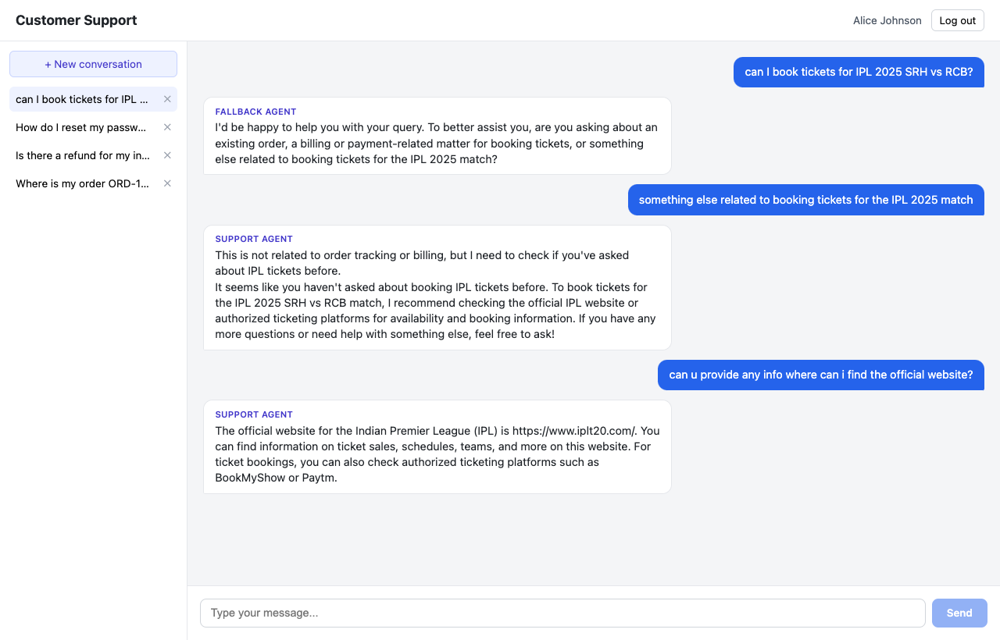
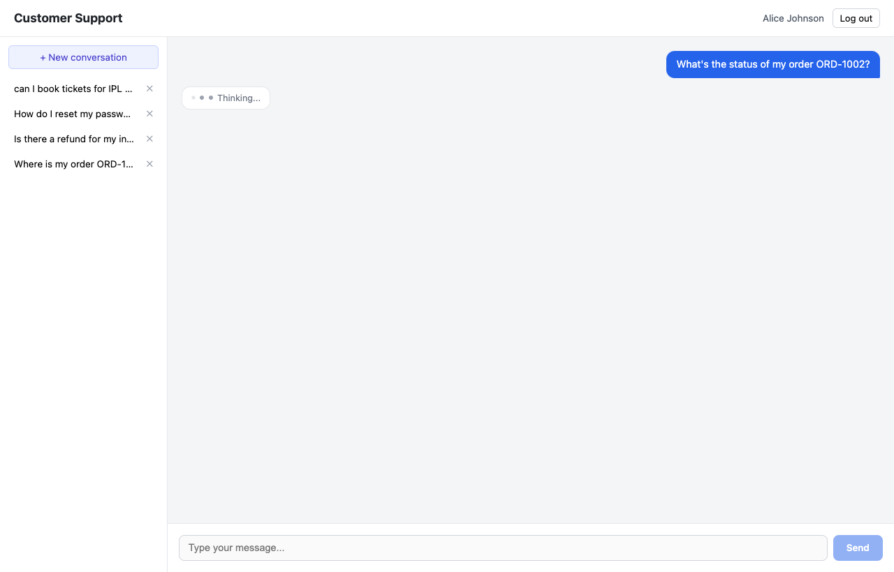

# Customer Support Multi-Agent System

An AI-powered customer support system with a **router agent** that classifies incoming
customer messages and delegates to one of three specialized sub-agents (Support, Order,
Billing), each backed by tools that query real data from a seeded Postgres database.

## Architecture

```
frontend/   React + Vite chat UI (login, conversation list, streaming chat window)
backend/    Hono.dev API
  src/
    agents/      Router Agent + Support/Order/Billing/Fallback sub-agent definitions
    tools/       DB-backed tools each sub-agent can call (Vercel AI SDK `tool()`)
    services/    Business logic (conversation persistence, agent orchestration, auth)
    routes/      Hono route handlers ("controllers") - thin, delegate to services
    middleware/  Central error handler, JWT auth guard, rate limiter
    db/          Drizzle schema, seed script, migrations
```

**Controller-service pattern**: routes in `src/routes/*` only parse/validate input and call
a service function - they never touch Drizzle directly. Services in `src/services/*` own
all business logic and database access. Tools in `src/tools/*` are the only things agents
can call, and each tool queries the database directly, scoped to the authenticated
`userId` so one customer's agent session can never read another customer's data.

**Routing logic**: `POST /api/chat/messages` first calls `classifyQuery` (the Router
Agent - `src/agents/router.agent.ts`), which uses a fast model (`llama-3.1-8b-instant` via
Groq) with a structured-output schema (`ai`'s `generateObject`) to classify the latest
message into `support` / `order` / `billing` / `fallback`, given the trimmed conversation
history. The matching sub-agent is then loaded from `AGENT_REGISTRY`
(`src/agents/index.ts`), given its own system prompt and tools bound to the current
user/conversation, and streams its answer with a larger model (`llama-3.3-70b-versatile`)
via `streamText`. This two-model split (small/fast for routing, larger for the actual
answer) keeps routing latency low without slowing down the response users actually read.
Both model instances are constructed once in `src/lib/model.ts` - swapping model/provider
only means editing that one file.

**Why Groq/Llama and not Claude/Gemini**: the AI provider isn't dictated by the assessment
brief, only "Vercel AI SDK" is. Groq's free tier (console.groq.com, no card) gives reliable,
standard OpenAI-style tool calling on the `ai@4.x` SDK line this project is built on.
Gemini was tried first, but new API keys are already locked out of Gemini 2.0/2.5 (both
deprecated to new users), and the remaining Gemini 3.x line requires a `thought_signature`
be echoed back on every tool-calling turn - support for that isn't threaded through
`streamText`'s multi-step tool loop in the installed SDK version yet
([tracked upstream](https://github.com/vercel/ai/issues/10344)). Fixing that properly would
mean migrating through three stacked breaking-change SDK releases (v4 -> v5 -> v6 -> v7),
which was a bigger and riskier undertaking than swapping providers.

**Conversation context**: every message is persisted to Postgres
(`conversations` / `messages` tables). Before each turn, `buildHistoryForModel` loads the
most recent messages for that conversation (capped at 20, newest-first then reversed to
chronological order) and passes them to whichever sub-agent handles the turn - so context
carries across turns *and* across agent handoffs (e.g. asking a billing question after an
order question still has the order context available).

**Error handling**: every route throws `AppError` (or lets unexpected errors bubble) -
there's a single `app.onError(errorHandler)` middleware that turns any thrown error into a
consistent `{ error: { message, status } }` JSON response. No route catches and formats
its own errors.

**Streaming + typing indicator**: the response streams as Server-Sent Events with three
event types - `routing` (fires immediately after classification, before any answer text;
drives the "X Agent is typing..." indicator and exposes which agent is handling the
query), `token` (one text delta at a time), and `done` (final persisted message id). The
frontend reads the fetch response body as a stream and parses these manually (native
`EventSource` doesn't support POST).

## Tech stack

| Layer | Choice |
|---|---|
| Frontend | React + Vite |
| Backend | Hono.dev (`@hono/node-server`) |
| Database | PostgreSQL |
| ORM | Drizzle |
| AI | Vercel AI SDK (`ai`, `@ai-sdk/groq`) with Llama 3.x (free tier) |
| Auth | JWT (seeded demo users, no signup flow) |

## Setup

### Prerequisites
- Node.js 18+
- A running PostgreSQL instance (local, Docker, or hosted e.g. Neon/Supabase)
- A Groq API key - free, no card required, at https://console.groq.com/keys
  (or skip it entirely and use `MOCK_LLM=true`, see below)

### 1. Database

Easiest option - Docker Compose (spins up Postgres 16 on `localhost:5433`, not the default
5432, so it won't collide with a Postgres instance you might already have running locally):

```bash
docker compose up -d
```

Or point `DATABASE_URL` at any existing Postgres instance / hosted DB (Neon, Supabase, etc).

### 2. Backend

```bash
cd backend
cp .env.example .env
# edit .env: set DATABASE_URL, GROQ_API_KEY, JWT_SECRET
npm install
npm run db:migrate     # applies the committed migration in src/db/migrations/
npm run db:seed        # seeds demo users/orders/invoices/conversation
npm run dev             # starts on http://localhost:4000
```

Demo login: `alice@example.com` / `password123` (or `bob@example.com` / `password123`).

### 3. Frontend

```bash
cd frontend
cp .env.example .env   # VITE_API_URL, defaults to http://localhost:4000
npm install
npm run dev              # starts on http://localhost:5173
```

### 4. Tests

```bash
cd backend
npm test
```

## API routes

```
/api
├── /auth
│   └── POST /login                    # { email, password } -> { token, user }
├── /chat            (requires Authorization: Bearer <token>)
│   ├── POST   /messages                # { conversationId?, message } -> SSE stream
│   ├── GET    /conversations/:id       # conversation + full message history
│   ├── GET    /conversations           # list this user's conversations
│   └── DELETE /conversations/:id
├── /agents
│   ├── GET /agents                     # list available agents + their tools
│   └── GET /agents/:type/capabilities
└── /health
```

## Testing without any API key

Set `MOCK_LLM=true` in `backend/.env` to run the whole system without a Groq key at all.
This swaps the Router Agent's classification and the sub-agents' replies for a keyword
heuristic + templated text (`src/services/mockAgentOrchestrator.service.ts`) - but real
Postgres queries, persistence, SSE streaming, and the typing indicator all still run
exactly as they do with real model calls. Every mock reply is prefixed `[mock ...]` so
it's never mistaken for a real model response. This is a local-dev convenience only -
`runOrchestration` (`src/services/agentOrchestrator.service.ts`) is the real
router -> sub-agent implementation being evaluated, and `MOCK_LLM` should stay unset/false
for the actual demo/review.

## Scope notes / deliberate cuts

Given the 2-3 hour time budget, a few things were intentionally kept simple rather than
gold-plated - happy to discuss trade-offs for any of these:

- **Auth**: seeded demo users + login only, no signup/registration flow.
- **Context management**: a hard cap on the last 20 messages, not token-counted
  summarization/compaction. Simple to reason about and explain; a real compaction pass
  (summarize older turns once a token budget is exceeded) would be the next step.
- **Order/refund mutations**: agents can look up orders/invoices/refunds but don't have
  tools to actually cancel an order or create a refund - they explain what they found and
  what would need to happen, rather than silently no-op'ing a fake mutation.
- **Monorepo/Turborepo + Hono RPC**: not set up for v1 (single repo, hand-duplicated
  frontend/backend types) to prioritize finishing the core multi-agent system within the
  time budget; a reasonable next step if converting to a Turborepo workspace.
- **Rate limiting**: simple in-memory fixed-window limiter per user on
  `POST /chat/messages` - fine for a single process, would need a shared store (e.g. Redis)
  to work across multiple server instances.
- **Deployed live demo**: not attempted. The app runs fully locally (Docker Compose Postgres
  + `npm run dev` on both sides) - see Setup above.

## Screenshots

Real captures from a running session (`MOCK_LLM=false`, live Groq/Llama calls) - not mocked
UI states.

**Fallback → Support handoff, multi-turn context**: an off-topic question (booking IPL
tickets) correctly lands on the Fallback Agent, which asks a clarifying question instead of
guessing. Once clarified, it's handled by the Support Agent - and the *next* message
("where can I find the official website?") is answered correctly with no order/billing
context at all, purely from the conversation history carried across turns.



**Real-time typing indicator**: fires immediately after the user sends a message, cycling
reasoning words ("Thinking...") while the Router Agent classifies, before any answer text
exists.


